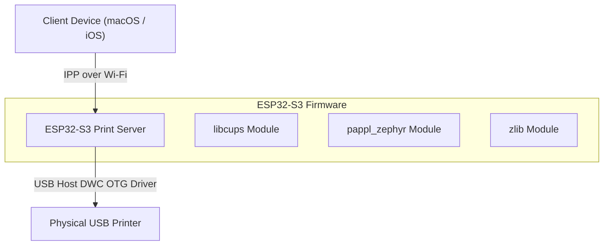

<p align="left">
  <a href="https://www.zephyrproject.org/"></a>
  
  
  
</p>

# Zephyr CUPS and PAPPL Print Server

This repository contains an embedded print server implementation running on Zephyr RTOS. It integrates CUPS (Common UNIX Printing System) and PAPPL (Printer Application Framework) specifically for Espressif systems.

**Note**: This project is exclusively supported on the ESP32-S3. Standard ESP32 microcontrollers are unsupported due to the requirement of a native USB OTG controller (DWC OTG) for printer communication and the high RAM footprint requiring external PSRAM/SPIRAM.

## System Architecture

The following diagram illustrates the network and hardware interface mapping of the print server:



## Features

* **Zephyr RTOS Integration**: Built as a standard Zephyr application utilizing Kconfig and the CMake build system.
* **Apple Raster and PWG Raster Support**: Processes uncompressed Apple Raster (image/urf) and PWG Raster streams. The system disables direct PDF rendering to force rasterization on the client device (macOS or iOS), reducing RAM and CPU utilization on the microcontroller.
* **USB Host Stack**: Queries configuration and interface descriptors of connected USB printers using Espressif's native USB host driver wrapper.
* **Network Discovery**: Automatically advertises IPP printing services on the local network via mDNS and DNS-SD over Wi-Fi.
* **External Heap Allocation**: Utilizes SPIRAM/PSRAM to allocate the large buffers required for print queues and raster image streams.

## Repository Structure

* `boards/` - Hardware configurations and devicetree overlays.
* `include/` - FreeRTOS compatibility shims and custom headers.
* `tests/` - Test suites and application code for PAPPL, libcups, and zlib.
* `CMakeLists.txt` - Project compilation and linking configuration.
* `prj.conf` - Base configuration defining network buffers, POSIX shims, and mbedTLS options.
* `west.yml` - West manifest containing upstream dependencies and repository references.
* `user-mbedtls.h` - Customized mbedTLS header configuration for embedded targets.

## Dependencies

The project workspace is managed using West and retrieves the following dependencies:

| Dependency | Fork Repository | Role |
| :--- | :--- | :--- |
| Zephyr RTOS | `HubertYGuan/zephyr` | Underlying RTOS kernel and drivers |
| zlib | `nomkar24/zlib` | Data decompression for print streams |
| pdfio | `nomkar24/pdfio` | PDF processing utility engine |
| libcups | `nomkar24/libcups_zephyr` | Core CUPS client and printer shims |
| pappl_zephyr | `nomkar24/pappl_zephyr` | Ported PAPPL framework interface |

## Getting Started

### 1. Initialize Workspace

Initialize the workspace using West:

```bash
west init -m https://github.com/nomkar24/CUPS_ZEPHYR.git --mr main workspace
cd workspace
west update
```

### 2. Configure Wi-Fi Credentials

Specify your Wi-Fi credentials in `tests/pappl/wifi_config.h`:

```c
#define SSID "your-ssid"
#define PSK  "your-password"
```

### 3. Build and Flash

Compile and flash the firmware to the target ESP32-S3 board:

```bash
west build -b esp32s3_devkitc_procpu
west flash
```

## Technical Overview

### Print Pipeline
The application uses the `pwg_common-300dpi-600dpi-srgb_8` driver profile. This profile signals client devices to perform local rendering. The client transmits the pre-rasterized data stream via the Internet Printing Protocol (IPP), and the print server pipes it directly to the printer over USB with minimal internal buffering.

### Heap Wrapper and POSIX Shims
Because CUPS and PAPPL require POSIX threading and dynamic allocations, the build system wraps memory management functions (such as `shared_multi_heap_alloc`) and maps standard POSIX APIs to Zephyr's POSIX subsystem.