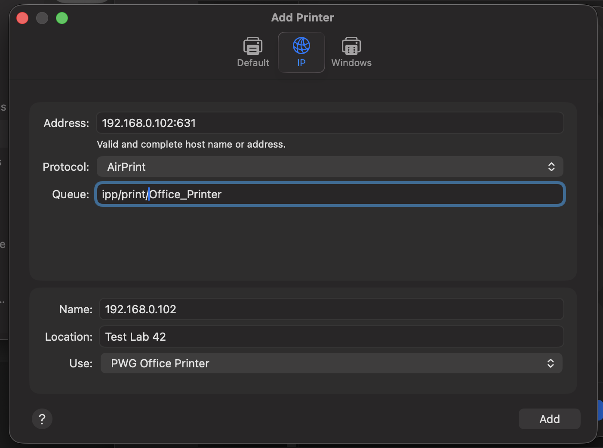
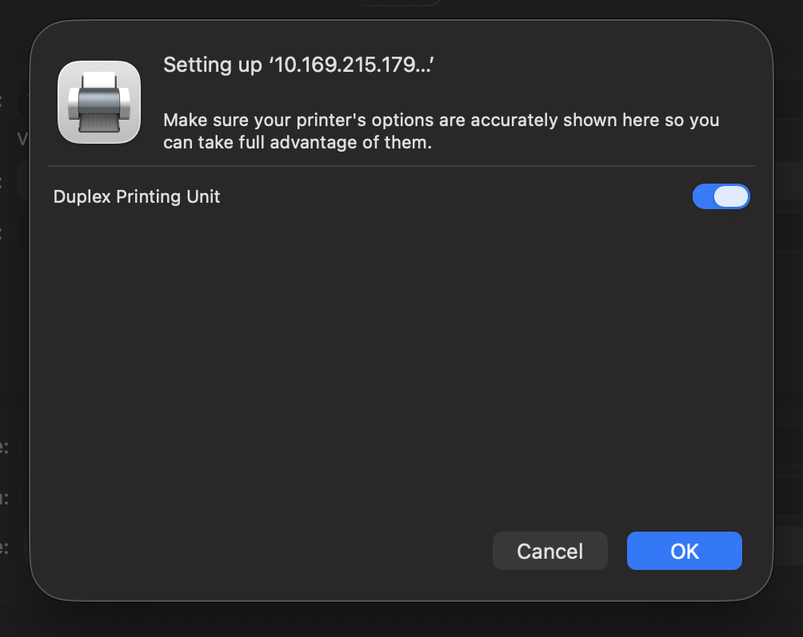
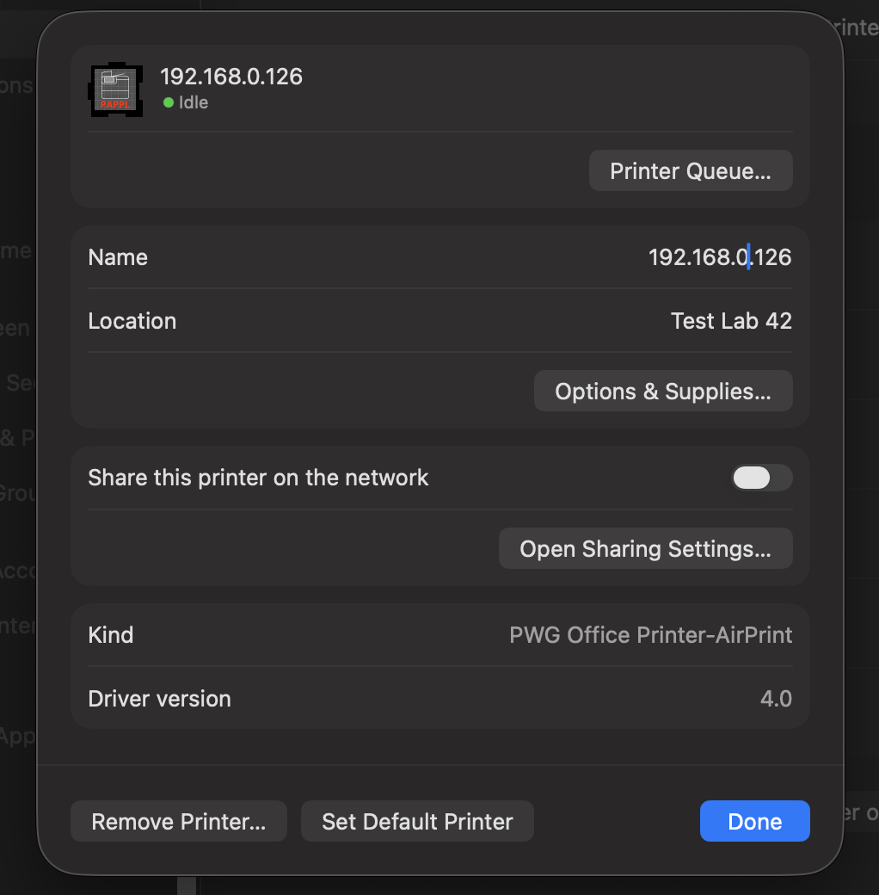
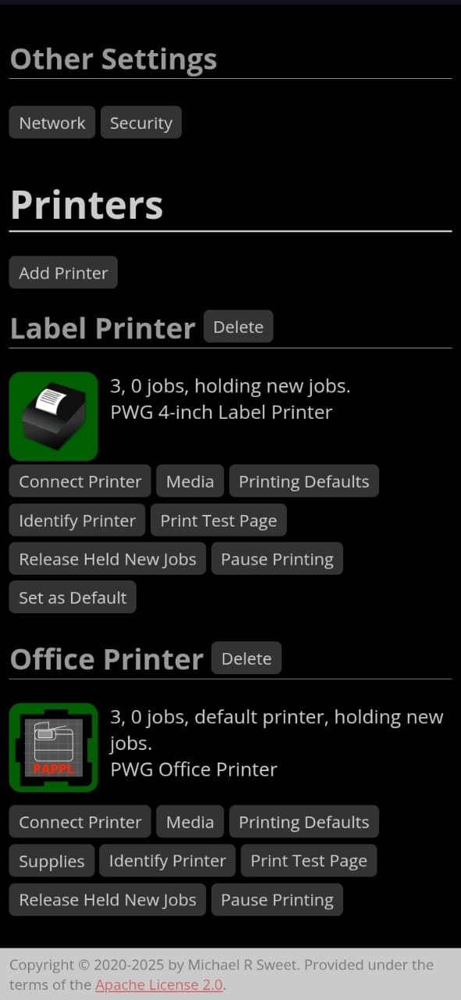
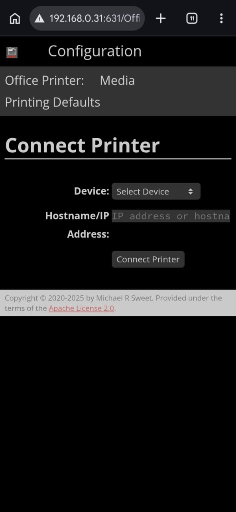
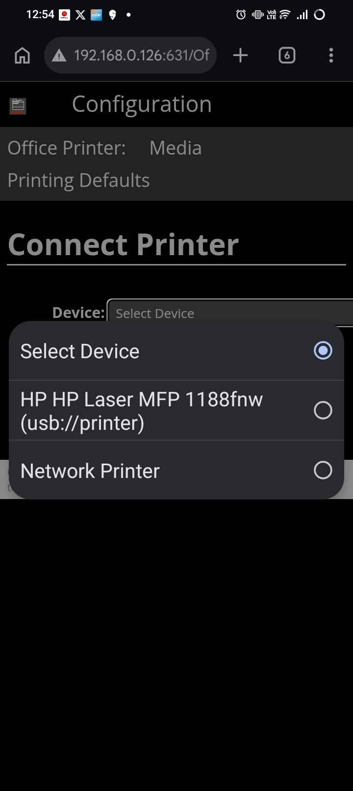
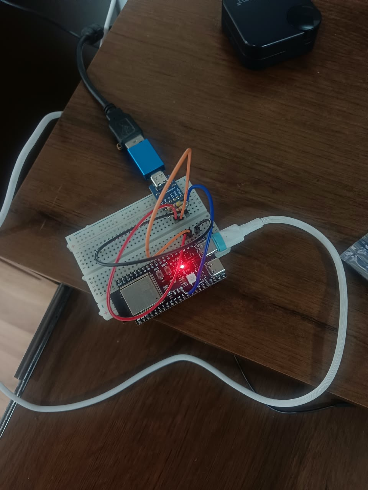
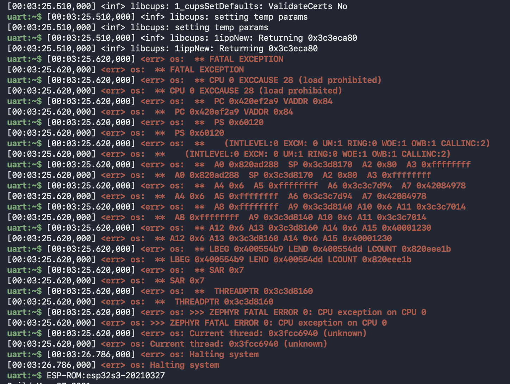

# [Porting OpenPrinting to Zephyr](https://openprinting.github.io/gsoc/2026/Porting-OpenPrinting-Software-to-Zephyr) 

## GSOC’26 : The Linux Foundation, OpenPrinting

##  [Omkar Nanajkar](https://www.linkedin.com/in/nomkar/) 

# Introduction : 

As printers move further toward driverless IPP Everywhere printing, OpenPrinting's printing software stands at the forefront of this movement,  enabling various driverless print servers. However, for such a print server to be integrated directly within and/or sold with a printer while keeping costs low, a suitable low power, low form factor platform to run the server is needed. This places the system in the realm of embedded systems, where real time operating systems (RTOSes) are preferred for their reliability for time critical tasks. However, full fledged print servers are currently only supported on general purpose operating systems (GPOSes) such as Linux, which many embedded microcontrollers and some system on chip (SoC) based platforms do not support.

This project aims to address this issue by continuing the porting of the OpenPrinting printing stack, including libraries like libcups and parts of PAPPL, as well as applications such as PAPPL and CUPS, to Zephyr, a major open source RTOS. Furthermore, details on hardware requirements, IPP-over-USB communication with printers, and software changes should be investigated.

This project is the continuation of [Hubert Guan's GSoC 2025 project.](https://hubertyguan.github.io/GSoC-2025/posts/final/)

# GitHub Repositories : 

1) [CUPS for Zephyr](https://github.com/nomkar24/CUPS_ZEPHYR)  
2) [PAPPL for Zephyr](https://github.com/nomkar24/pappl_zephyr)  
3) [PDFio Library](https://github.com/nomkar24/pdfio)  
4) [Libcups for Zephyr](https://github.com/nomkar24/libcups_zephyr)  
5) [mDNS Implementation](https://github.com/nomkar24/mDNS)

# Setup : 

To connect the printer to your PC, first add an ESP32-S3 microcontroller board as a printer in your system's printer settings using the following details:

Address : IP:631  
Queue   : ipp/print/Office\_Printer

<p align="center">
  
</p>

Once added, the connection should be established, as shown below.

<p align="center">
  
</p>

Verify properties. 

<p align="center">
  
</p>

Open the web interface by navigating to:

http://\<IP\>:631

Ensure that your ESP32, printer, and client device (PC and phone both) are connected to the same WiFi network. Do not use a mobile hotspot.

#### **Why not a mobile hotspot ?**

After spending quite some time debugging, I discovered that the issue wasn't with the ESP32 at all, it was my phone's hotspot. Most smartphones enable AP (Access Point) Client Isolation by default. This prevents devices connected to the hotspot from communicating with one another, which means your PC or phone cannot access the ESP32's web server even though both appear to be connected to the same hotspot.

Using a standard WiFi router avoids this issue because devices on the network are allowed to communicate with each other.

#### **Phone vs Laptop Browser ?**

During testing, I also observed that a phone browser works more reliably than a desktop browser. Desktop browsers tend to request additional resources (such as icons and other assets), which increases the load on the ESP32 web server.

If you need to access the interface from a laptop, consider using Lynx, a lightweight terminal based web browser that generates far fewer requests. However, for the best experience, accessing the web interface from a phone browser is recommended.

The webpage should look like this:  
 
<p align="left">
  
  
</p>

### **Part A: Connecting the ESP32 to a WiFi Printer**

1. In the Office Printer section of the web interface, click Connect Printer.  
2. From the list of available printers, select the printer whose name contains the IPP keyword, and then click Connect Printer.  
3. If the connection is successful, the webpage will automatically redirect to the home screen.

At this point, the ESP32 is connected to the WiFi printer, and your laptop is connected to the ESP32.

Open a terminal and navigate to the directory containing the PDF you want to print.

Note : Keep the PDF size as small as possible (preferably in KB) for better performance.

Run the following command to check the list of available printers :

```bash
lpstat -p
```

To print a PDF, use :

```bash
lpstat -d <PrinterName> <PdfName.pdf>
```

When you execute the second command, the PDF is first converted into Apple Raster format by the CUPS. The rasterized print job is then spooled and sent to the ESP32 S3 over IPP-over-Wi-Fi.

As soon as the ESP32 receives the spooled data, it forwards the print job to the connected printer. The printer then processes the received data and prints the PDF.

The printed output is shown below.

Since this was the first successful print using the ESP32 printer server, I also recorded a video of the moment as proof.

<video src="https://github.com/nomkar24/CUPS_ZEPHYR/blob/main/assets/Printer_WIFI.mp4?raw=true" controls width="100%"></video>

### **Part B: Connecting the ESP32 to a USB Printer**

1. Connect the printer's USB cable to the ESP32 S3 through a USB Type-C breakout board. I used the breakout board so I could access the ESP32's serial logs for debugging while the USB interface was being used for data transfer.

Connections:

* D− → GPIO 19  
* D+ → GPIO 20  
* VBUS → 5V  
* CC1 → 5.1 kΩ pull down resistor to GND  
* CC2 → 5.1 kΩ pull down resistor to GND

<p align="center">
  
  
</p>

1. In the Office Printer section of the web interface, click Connect Printer.  
2. From the list of available printers, select the printer whose name contains the USB keyword, and then click Connect Printer.  
3. If the connection is successful, the webpage will automatically redirect to the home screen.  
   

At this point, the ESP32 is connected to the WiFi printer, and your laptop is connected to the ESP32.

Open a terminal and navigate to the directory containing the PDF you want to print.

Note : Keep the PDF size as small as possible (preferably in KB) for better performance.

Run the following command to check the list of available printers :

```bash
lpstat -p
```

To print a PDF, use :

```bash
lpstat -d <PrinterName> <PdfName.pdf>
```

When you execute the second command, the PDF is first converted into Apple Raster format by the CUPS. The rasterized print job is then spooled and sent to the ESP32 S3 over IPP-over-USB.

As soon as the ESP32 receives the spooled data, it forwards the print job to the connected printer. The printer then processes the received data and prints the PDF.

The printed output is shown below.

Since this was the first successful print using the ESP32 printer server over USB, I also recorded a [video](https://drive.google.com/file/d/1eY1ciZPsUh6t_blRaXE3Kxf9j6KCyEIC/view?usp=sharing) of the moment as proof.

# Major Challenges : 

1. ## Stabilizing Web Page : 

   The initial management interface used a USB CDC (Serial) command line interface to monitor PAPPL and printer status. While useful for debugging, it was not suitable for end users. To provide a better user experience, the interface was migrated to PAPPL's built in Web Interface on the standard IPP port (631).  
   During deployment, the Web UI frequently timed out or caused the ESP32 S3 to hang. Two issues were identified:

     
     
* **AP Isolation:** Testing over a smartphone hotspot failed because AP Isolation prevented communication between the computer and the ESP32 S3. Switching to the lab WiFi router resolved this issue.  
*   
* **Network Resource Exhaustion:** PAPPL serves multiple resources (HTML, CSS, images, etc.) using concurrent TCP connections. The default Zephyr TCP buffer configuration was insufficient, leading to packet congestion and system instability.  
  The problem was resolved by increasing the TCP window sizes and network buffer counts in prj.conf:

```
CONFIG_NET_PKT_RX_COUNT=80
CONFIG_NET_PKT_TX_COUNT=80
CONFIG_NET_BUF_RX_COUNT=144
CONFIG_NET_BUF_TX_COUNT=144
```

  After tuning these parameters, the Web Administration Interface became stable and responsive. This demonstrated the importance of properly configuring Zephyr's network stack when running resource intensive applications such as PAPPL on embedded systems.

<p align="center">
  
</p>

2. ## Memory constraints : 

   Operating both the PAPPL framework and the Zephyr network stack on an ESP32 S3 microcontroller proved to be a significant challenge due to the device's limited SRAM and Flash. The system frequently reached its hardware boundaries, necessitating several strategic memory optimizations to maintain system stability and avoid crashes caused by memory exhaustion.

   #### **1\. Disabling Unnecessary Services**

   To reclaim vital heap and stack space, I disabled several non essential shells and diagnostic tools:

* **USB CDC Console**: I transitioned to standard UART logging, which eliminated the need for active USB endpoints and their associated buffers.  
* **Thread Analyzer & Tracing**: Profiling overhead was removed by setting *CONFIG\_THREAD\_ANALYZER* and *CONFIG\_TRACING* to no.  
* **Shell Modules**: Various unused modules, such as the kernel and memory shells (*CONFIG\_KERNEL\_SHELL=n*), were removed from the *prj.conf* file.

#### **2\. Asset Offloading to Flash ROM**

The web interface icons and logos were initially consuming dynamic RAM. These large PNG assets were migrated to static storage to preserve memory.

* I converted the web assets into *const static uint8\_t* arrays within header files like *label-png.h*.  
* By using the *const* qualifier, the compiler stored these files in the SPI Flash ROM instead of SRAM, recovering more than 170 KB of memory.

  #### **3\. Minimizing Localization Data**

  PAPPL typically includes several language catalogs, but compiling these string tables uses a large amount of Flash space.

* I removed all translation files, keeping only the essential English strings for the interface.  
* This optimization significantly lowered the footprint of the IPP dictionary and saved substantial Flash storage.

#### **4\. Tuning Stacks and Buffers**

I used runtime statistics (*CONFIG\_SYS\_HEAP\_RUNTIME\_STATS*) to monitor and fine tune system stacks for the best performance :

* The memory pool for the system heap was set to 49152 to prevent crashes during heavy network activity.  
* Dynamic stacks, such as *CONFIG\_CUPS\_THREAD\_SIZE*, were increased to 131072 to handle complex AirPrint rendering tasks without causing overflows.

<p align="center">
  
</p>

3. ## Printing out Garbage values : 

   After spending a lot of time reviewing serial monitor logs and fixing several issues, the printer finally responded but not as expected. Instead of printing a simple 7 kB PDF with text OpenPrinting, it produced the following output (RaS2). The ESP32 was correctly forwarding all the data it received from the local machine, but the printer was unable to decode the incoming print stream. 

   ![][image6]  
   

   After a few more fixes, I somehow made things even worse. The printer entered an infinite loop, continuously printing garbage characters without stopping. The only way to stop it was to switch off the printer directly.[\[video\]](https://drive.google.com/file/d/1VXOTIzhWR1RAQlEMBc1HkR6qMeG5izR8/view?usp=share_link)  
   Eventually, after tracking down the remaining issues, the ESP32-S3 successfully worked as an IPP bridge between the local machine and the printer. With that milestone achieved, I moved on to implementing IPP-over-USB support which, unsurprisingly, resulted in another round of garbage output.

   ![][image7]

# Future Work : 

Ongoing development will focus on further optimizing memory usage, as RAM consumption remains quite high for embedded targets. Potential avenues include extending support to additional hardware platforms, such as the nRF series, and investigating the integration of the full rasterization pipeline directly into Zephyr. Ultimately, this work paves the way for developing a complete printing solution powered entirely by the Zephyr RTOS, independent of traditional operating systems like Linux or macOS.

# Blog : 

This marks the end of my Google Summer of Code project and the final evaluation.

This has been one of the hardest projects I've worked on so far. It wasn't just about writing code, it demanded creativity, patience, and countless hours of debugging. For the last three months, my monitor has mostly been filled with red error logs.

After countless experiments, failures, and "aha\!" moments, the ESP32 is now successfully acting as a printer server. It receives Apple Raster data over IPP-over-WiFi from a PC and forwards it to a printer. The printer can be connected either through USB or WiFi, and it now prints documents reliably.

One of the biggest challenges was that the original software was designed for Linux, but I managed to make it run on an ESP32 with just 8 MB of RAM, thanks to Zephyr's excellent documentation and the incredible work of the OpenPrinting community.

I genuinely enjoyed every part of this project, even the frustrating ones. I can't count how many times I found myself asking, "Did the printer make any noise?" Nope. Back to reading terminal logs and debugging.

A huge thank you to my mentors for believing in me, helping me even before I was selected, and guiding me throughout the project. I couldn't have asked for better mentors.

The best part? This project can turn an ordinary USB printer into a WiFi printer using hardware that costs only about $4–5 USD. Considering that WiFi enabled printers often cost nearly twice as much as their USB only counterparts, this could make wireless printing much more accessible.

Who knows, maybe it's a printer company's worst nightmare... or maybe it's the beginning of a small revolution in the printer industry.

Either way, it has been an unforgettable journey.

Thanks.


[image1]: ../assets/1.png
[image2]: ../assets/2.png
[image3]: ../assets/3.png
[image4]: ../assets/4.jpeg
[image5]: ../assets/5.jpeg
[image6]: ../assets/6.jpeg
[image7]: ../assets/7.jpeg
[image8]: ../assets/8.jpeg
[image9]: ../assets/9.png
[image10]: ../assets/10.png
[video1]: ../assets/Printer_WIFI.mp4